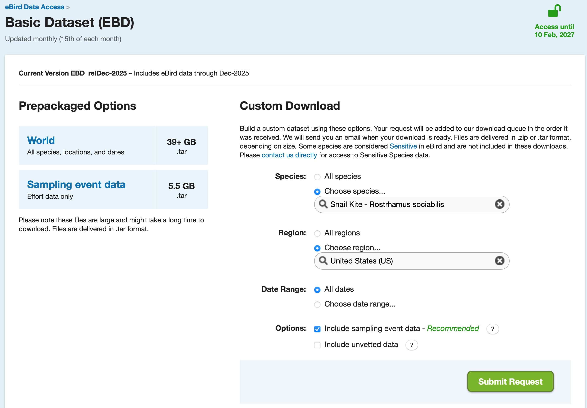
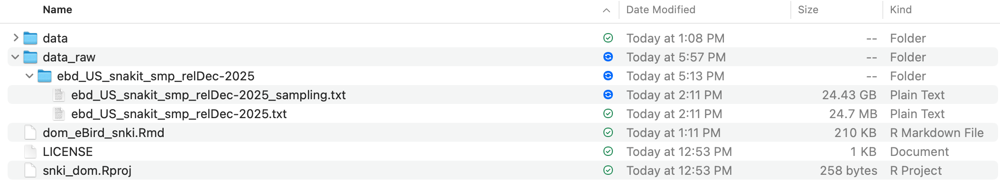
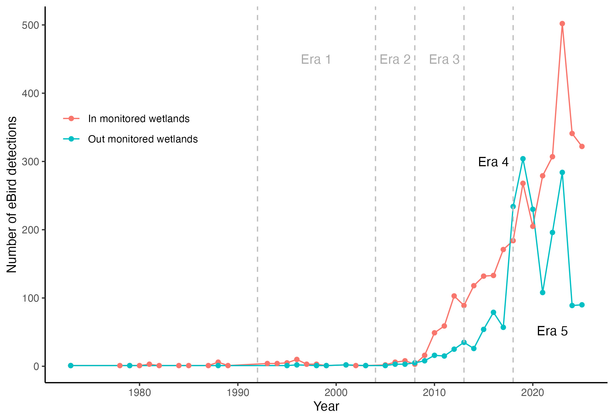

# Read me (begin here)

This code aims to contrast the counts of snail kites in and out wetlands monitored by the UF-SNKI project. For this, Brooke worked in ARCGIS to generate two shapefiles: Florida wetlands (not monitored by the UF-SNKI project) and Wetlands monitored by the UF-SNKI project. The first shapefile reflects water in the peninsula, so we added a buffer of 1 km around each "wetland" to include the location uncertainty of the snail kite counts in eBird, and removed the monitored wetlands to have the contrasting groups more clear in our design. We used the eBird data, segregating by the known "Era"s (Era 1: 1992-2004; Era 2: 2005-2008; Era 3: 2009-2013; [sensu Cattau et al. 2016](https://doi.org/10.1890/15-1020.1)), but incorporating two new arbitrary ones (Era 4: 2014-2018; Era 5: 2019-2025). Given the temporal dynamic of eBird data sampling (see timeline figure below), we extracted the weekly maximum counts reported for the years 2014 to 2025 (Era 4 and Era 5), for the weeks 9 to 26 (roughly from March 01 to June 30, as the original robust design description in [Dreitz et al. 2002](http://dx.doi.org/10.1080/02664760120108854)).

# Packages, models, and functions

## Packages required
```{r package-loading, message=FALSE, warning=FALSE}
#To extract presences of any Pomacea during the sampling period we can use dismo
library(dismo)
#To conduct eBird data filtering and manipulation (see Strimas et al. 2018 and 2023)
  library(auk); 
#To data management and visualization - sevent packages in one
  library(tidyverse)
#To conduct Spatiotemporal Subsampling
  library(dggridR)
#Simple features to encode spatial vector data
  library(sf)
#load maps
  library(maps); 
#composite figure
  library(gridExtra); 
#equation in figure with panels (`ggplot2::ggplot()`; `facet_wrap()`)
  library(ggpubr);
```

# eBird data organization to extract counts per week

This section is based on [Acevedo-Charry *et al.* (2025)](https://doi.org/10.1111/1365-2664.70108). We should download the `ebd` file from
[eBird](https://ebird.org/data/download). See the supplement to
[Johnston *et al.* (2021)](https://doi.org/10.1111/ddi.13271) in
[Strimas-Mackey *et al.* (2023)](https://ebird.github.io/ebird-best-practices/), which is a key reference for the next section.

## Download eBird data

### Go to eBird and sign in

Go to [eBird](https://ebird.org/data/download). You have to sign-in into
eBird:

| {width=100%}
<br>

### Request data

If you are in the home page, check you are signed-in and move down on the
page to "Request data".

| {width=100%}
<br>

You have to submit an application to have access to the data. Once you
have access, click on "Basic dataset (EBD)" (it will show the window of access).

| {width=100%}
<br>

Then, you can select by species, region, and/or date. In our case, lets
download *Rostrhamus sociabilis* in US.

| {width=100%}
<br>

In the options, include the sampling event data always is a good recommendation. In snail kite for US it will save the sampling event, but for other Neotropical species tested in preliminary attempts, the sampling data was not included and the user should download the "Sampling event data" of 5.5 GB (comprised in `.tar` format). This step is critical for our aim of fitting a dynamic occupancy model and control for imperfect detection!!

| {width=100%}
<br>

After submitting the request, the link to download will arrive to the
email registered in your eBird account. You can save the `.txt` files
in a `data_raw` directory to be called during the refining process through filtering.

| {width=100%}
<br>

These files have the records of the species and (in this case) the sampling file to zero-filling. Unfortunately, eBird does not allow to share this data (anyway the sampling file is ~25 Gb, so GitHub does not allow to put this big dataset there). But I see this as a good practice to ensure replicability. 

## Pre-filtering

We can simplify the eBird data selecting only columns of our interest
(it will reduce the size of the dataset).

```{r columns to filter-ebd, eval=FALSE}
colsE <- c("observer_id", "sampling_event_identifier",
           "group identifier",
           "common_name", "scientific_name",
           "observation_count",
           "country", "state_code", "locality_id", "latitude", "longitude",
           "observation_type", "protocol_name", "all_species_reported",
           "observation_date",
           "time_observations_started",
           "duration_minutes", "effort_distance_km",
           "number_observers")
```

To conduct some filters, we will generate temporal files in our computer. Here we generate only a single temporal file that can be overwritten to assess different species.

```{r temporary filter files, eval=FALSE}
f_ebd <- "data/ebd_Examples.txt" 
f_sed <- "data/sed_Examples.txt" 
```

## Refinament data by filtering

The package `auk`, in combination with `tidyverse`, allows the filtering
of the eBird data (see [Strimas-Mackey *et al.* 2023](https://ebird.github.io/ebird-best-practices/)). Note that the
first function `auk_ebd()` includes the path of the eBird data downloaded and saved in your working directory (up to December 2025), and it is the initial creation of an `auk_ebd` object. Then, different functions serve to filter the data by the metadata of the checklists. We followed the next order below:

 * records within the boundary box (W,S,E,N) or polygon: we can use the sf object from Brooke with `auk_bbox()`
 * only records and sampling during March-June, as the original temporal window from the six surveys in the standardized monitoring (`auk_date()` and using the wildcard `date = c("*-03-01", "*-06-30")`),
 * by protocol (`auk_protocol()`; only traveling or stationary), 
 * by distance (`auk_distance()`; $≤5$ km), 
 * by duration (`auk_duration()`; $≤5$ hours, note the units are in minutes: $300$), and 
 * only complete lists (`auk_complete()`). 
 
Then, the filters defined are converted to an AWK script with the function `auk_filter()`, generating a filtered eBird Reference Dataset (ERD) and sampling reference (SED), stored in the temporal files `f_ebd` and `f_sed`, respectively. The duration of this filter was 20 minutes. Then, the function `read_ebd()` read the filtered files. The duration for this process was 9 additional minutes. Finally, we generate a zero-filled file, a process of duration 4 additional minutes, plus some time saving the big-size file `snki_zf`.

```{r eval=FALSE}
snki_wetlands <- st_read("Shapefiles/ALLSITESCLEANED2_Project.shp")
fl_wetlands <- st_read("Shapefiles/FL_Wetlands_SNKI_noMon_1km.shp")

# I feel more confortable in geographic coordinate system (WGS84, EPSG: 4326), which is also the CRS for the eBird data
snki_wetls_geo <- st_transform(snki_wetlands, 4326)
fl_wetls_geo <- st_transform(fl_wetlands, 4326)

```

Filtering for the SNKI project polygon
```{r ebd-filter In, eval=FALSE}
start_time <- Sys.time()
ebd_filt_in<-auk_ebd("data_raw/ebd_US_snakit_smp_relDec-2025/ebd_US_snakit_smp_relDec-2025.txt", #Adjust in case update dataset
                    file_sampling = "data_raw/ebd_US_snakit_smp_relDec-2025/ebd_US_snakit_smp_relDec-2025_sampling.txt") |> #Adjust in case update dataset
    auk_bbox(bbox = snki_wetls_geo) |> #Could it be W, S, E, N or a sf object
    auk_date(date = c("*-03-01", "*-06-30")) %>% #only April-May, weeks 14-22
    auk_protocol(c("Traveling", "Stationary")) %>%
    auk_distance(distance = c(0,5)) %>%
    auk_duration(duration = c(0,300))%>%
    auk_complete() %>%
    auk_filter(f_ebd, f_sed, overwrite=T)

filt_time <- Sys.time()
filt_duration <- filt_time - start_time
print(filt_duration)  

#and with read_ebd we apply another filter to avoid repeat records from groups and call the two datasets from eBird (ebd and sed)
read_files_time <- Sys.time()
sed_only_in <- read_sampling(f_sed)
ebd_only_in <- read_ebd(ebd_filt_in)
read_files_duration <- Sys.time() - read_files_time
print(read_files_duration)
  
#Zero fill - Infer absences of events given the observations
start_zf_time <- Sys.time()
snki_zf_in <- auk_zerofill(ebd_only_in, sed_only_in, collapse = T)
zf_duration <- Sys.time()-start_zf_time
print(zf_duration)
saveRDS(snki_zf_in, "data/snki_zf_SNKIpoly.RDS")
```

Filtering for wetland habitats outisde the SNKI project polygon
```{r ebd-filter Out, eval=FALSE}
start_time <- Sys.time()
ebd_filt_out<-auk_ebd("data_raw/ebd_US_snakit_smp_relDec-2025/ebd_US_snakit_smp_relDec-2025.txt", #Adjust in case update dataset
                    file_sampling = "data_raw/ebd_US_snakit_smp_relDec-2025/ebd_US_snakit_smp_relDec-2025_sampling.txt") |> #Adjust in case update dataset
    auk_bbox(bbox = fl_wetls_geo) |> #Could it be W, S, E, N or a sf object
    auk_date(date = c("*-03-01", "*-06-30")) %>% #only April-May, weeks 14-22
    auk_protocol(c("Traveling", "Stationary")) %>%
    auk_distance(distance = c(0,5)) %>%
    auk_duration(duration = c(0,300))%>%
    auk_complete() %>%
    auk_filter(f_ebd, f_sed, overwrite=T)

filt_time <- Sys.time()
filt_duration <- filt_time - start_time
print(filt_duration)  

#and with read_ebd we apply another filter to avoid repeat records from groups and call the two datasets from eBird (ebd and sed)
read_files_time <- Sys.time()
sed_only_out <- read_sampling(f_sed)
ebd_only_out <- read_ebd(ebd_filt_out)
read_files_duration <- Sys.time() - read_files_time
print(read_files_duration)
  
#Zero fill - Infer absences of events given the observations
start_zf_time <- Sys.time()
snki_zf_out <- auk_zerofill(ebd_only_out, sed_only_out, collapse = T)
zf_duration <- Sys.time()-start_zf_time
print(zf_duration)
saveRDS(snki_zf_out, "data/snki_zf_SNKIpoly_out.RDS")
```

With these zero-filled file, we can confirm some sampling metadata and confirm presence in the polygons. Then, just for the sake of double checking and organization, we can remove the observations without counts (dubious `X` counts), add distance $0$ to stationary protocols, modify the time of observations started to decimal, round hour sampling to an integer, extract year, month, week, and day_of_year. Also, we can confirm and filter out by effort, such as observers $≤10$, distance $≤5 \text{ km}$, and duration $≤5 \text{ hours}$. These covariates could be further used to test their effects on population dynamic estimates (see [Fink *et al.* 2023](https://besjournals.onlinelibrary.wiley.com/doi/10.1111/2041-210X.14186)).

```{r eval = FALSE}
snki_zf_in <- readRDS("data/snki_zf_SNKIpoly.RDS")

snki_zf_in_sf <- snki_zf_in |>
  st_as_sf(coords = c("longitude", "latitude"), crs = 4326)

#sum(!st_is_valid(snki_wetls_geo)) 

snki_wetls_geo_valid <- st_make_valid(snki_wetls_geo) # 2 polygons were invalid

snki_in_wet_snki <- st_join(
  snki_zf_in_sf,
  snki_wetls_geo_valid, 
  join = st_within,
  left = FALSE # it seems this keep only matches
)

snki_zf_out <- readRDS("data/snki_zf_SNKIpoly_out.RDS")
snki_zf_out_sf <- snki_zf_out |>
  st_as_sf(coords = c("longitude", "latitude"), crs = 4326)

#sum(!st_is_valid(fl_wetls_geo)) 
fl_wetls_geo_valid <- st_make_valid(fl_wetls_geo) # 0 polygons were invalid

snki_out_wet_snki <- st_join(
  snki_zf_out_sf,
  fl_wetls_geo_valid, 
  join = st_within,
  left = FALSE # it seems this keep only matches
)

snki_zf <- bind_rows(list(`In monitored wetlands` = snki_in_wet_snki,
                          `Out monitored wetlands` = snki_out_wet_snki),
                     .id = "source")
#Effort and confirming filtering
  # Function to convert time observation to hours since midnight
time_to_decimal <- function(x) {
    x <- hms(x, quiet = TRUE)
    hour(x) + minute(x) / 60 + second(x) / 3600
  }
  
snki_eff <- snki_zf |>
    mutate(
      # recover the latitude and longitude info
      longitude = st_coordinates(geometry)[,1],
      latitude = st_coordinates(geometry)[,2],
      # Convert X counts to NA
      observation_count = as.integer(observation_count),
      # effort_distance_km to 0 for non-travelling counts
      effort_distance_km = if_else(protocol_name == "Stationary",
                                   0, effort_distance_km),
      # convert time to decimal hours since midnight
      time_observations_started = time_to_decimal(time_observations_started),
      hour_sampling = round(time_observations_started, 0),
      # split date into year, month, week, and day of year
      year = year(observation_date),
      month = month(observation_date),
      week = week(observation_date),
      day_of_year = yday(observation_date)) |>
    filter(number_observers <= 10,	       #Only list with less than 10 observers
           effort_distance_km <= 5,        #be sure of distance effort
           duration_minutes <= 300)        #be sure of duration effort
 #          day_of_year %in% (123:152),     #only the days of May - we can change this
#           hour_sampling %in% (6:11))      #only sampling in the morning 
saveRDS(snki_eff, "data/snki_eff_in_out.RDS")
```

This dataset with effort include the `species_observed == TRUE` for detections and `species_observed == FALSE` for no detections. We can filter out a temporal bias in sampling, which provides information that the species begins to be recorded in low prevalence since 1979. We will filter out data from 1995 (this could be adjusted).

```{r eval=FALSE}
snki_eff <- readRDS("data/snki_eff_in_out.RDS")

snki_eff |> 
  filter(species_observed == TRUE) |> 
  group_by(year, source) |> 
  count() |> #View()
  ggplot(aes(x = year, y = n, color = source))+
    geom_line()+
    geom_point()+
  geom_vline(xintercept = c(1992,2004, 2008, 2013, 2018), 
             linetype = "dashed", color = "gray")+
    labs(x = "Year",
         y = "Number of eBird detections",
         color = "")+
    annotate("text", x = 1998, y = 450, label = "Era 1", color = "darkgray")+
    annotate("text", x = 2006, y = 450, label = "Era 2", color = "darkgray")+
    annotate("text", x = 2011, y = 450, label = "Era 3", color = "darkgray")+
    annotate("text", x = 2016, y = 300, label = "Era 4")+
    annotate("text", x = 2022, y = 52, label = "Era 5")+
    theme_classic() +
    theme(legend.position = "inside", 
          legend.position.inside = c(0.15,0.7))
ggsave(filename = "data/Timeline_snki_US_eff_spatial.jpg")
```


To see spatially the detections In and Out the wetlands

```{r eval = FALSE}
#Load a map of the world
world1 <- sf::st_as_sf(map(database = 'world', plot = FALSE, fill = TRUE))
world1

MapRecords <- ggplot() +
  geom_sf(data = world1) +
  geom_point(data = snki_eff |> 
               filter(year >= 2014, 
                      species_observed == TRUE) |>
               mutate(era = ifelse(year >= 1992 & year <= 2004, "Era 1",
                               ifelse(year >= 2005 & year <= 2008, "Era 2",
                               ifelse(year >= 2009 & year <= 2013, "Era 3",
                               ifelse(year >= 2014 & year <= 2018, "Era 4\n(2014-2018)",
                               ifelse(year >= 2019 & year <= 2025, "Era 5\n(2019-2025)",
                                      NA)))))), 
             aes(x = longitude,
                 y = latitude, 
                 fill = source),
             size = 0.75, shape = 21, alpha = 0.5) +
  facet_grid(factor(source)~factor(era, 
                               levels = c("Era 1",
                                          "Era 2", 
                                          "Era 3", 
                                          "Era 4\n(2014-2018)", 
                                          "Era 5\n(2019-2025)")))+
  coord_sf(xlim = c(-89, -74), 
           ylim =  c(23, 35)) +
  labs(x = "Longitude", y = "Latitude", fill = "Detection")+
  theme_classic() +
  theme(legend.position = "none")
ggsave(MapRecords, filename = "data/MapRecords_spatio_buff.jpg", 
       width = 250, height = 150, units = "mm")

```


They seem to overlapp spatially, but it could be the temporal dynamic that we are interested!!!

```{r eval = FALSE}
MaxCountWeek <- snki_eff |>
  filter(year >= 2014) |>
  group_by(source, year, week) |>
  summarise(maxObsCount = max(observation_count)) |>
  ggplot(aes(x = week, 
             y = maxObsCount, 
             fill = source, 
             color = source)) +
    facet_wrap(~year, scales = "free_y") +
    geom_line() +
    geom_point(shape = 21, alpha = 0.75) +
    labs(x = "Week per year",
         y = "Maximum count of individuals per week", 
         fill = "", 
         color = "")+
    theme_classic() +
  theme(legend.position = "bottom")
ggsave(MaxCountWeek, filename = "data/Maximum_counts_per_week.jpg", 
       width = 250, height = 150, units = "mm")
```

