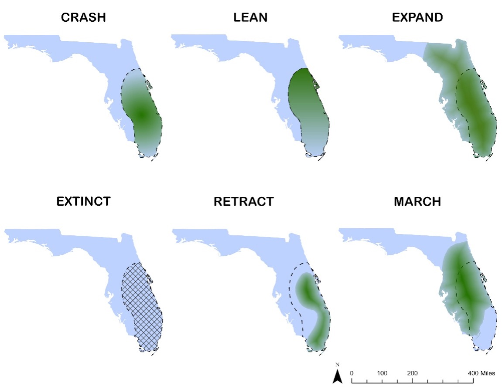
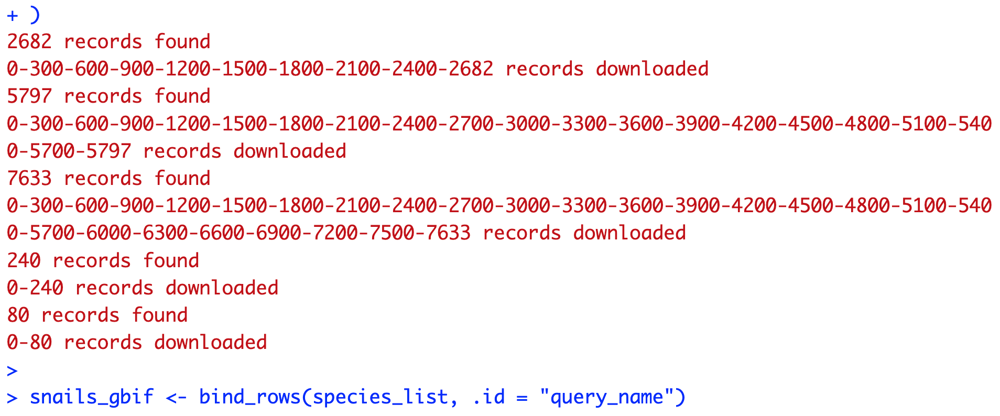
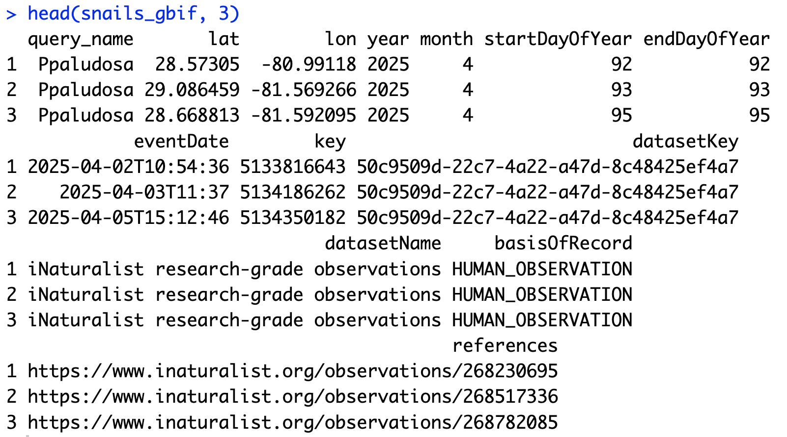
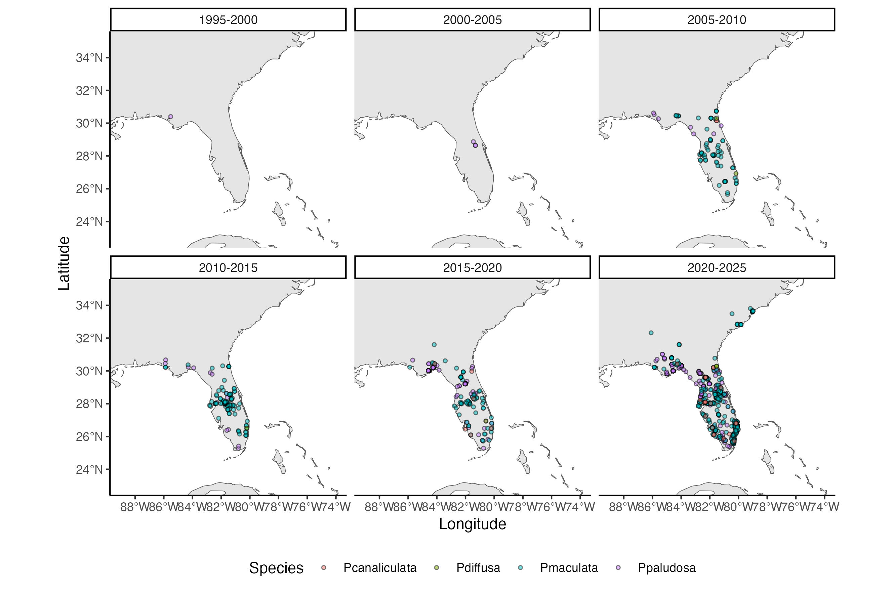
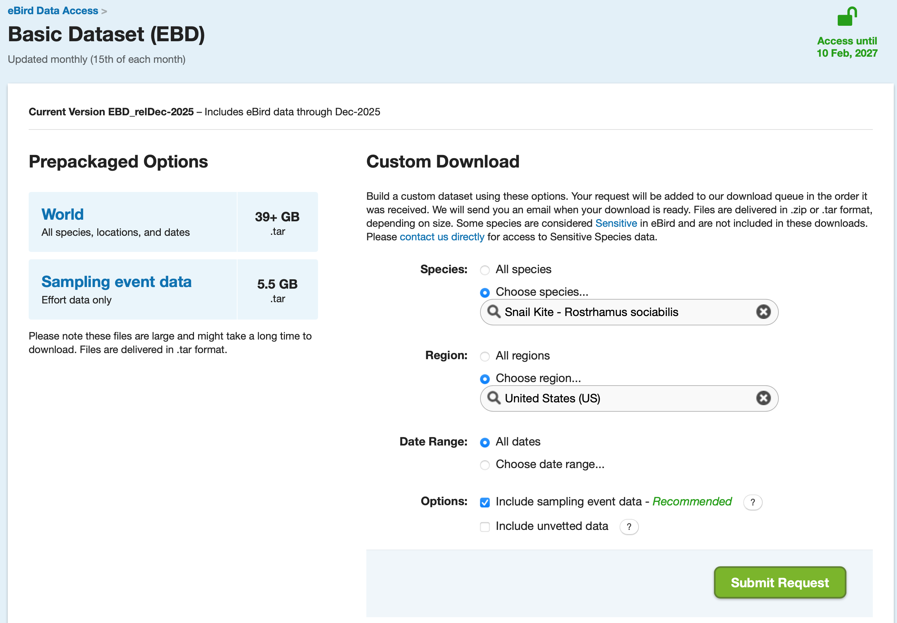
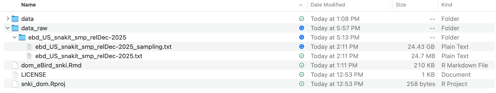
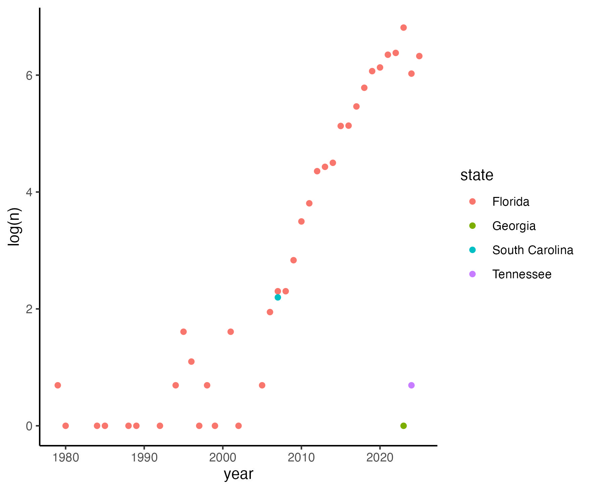
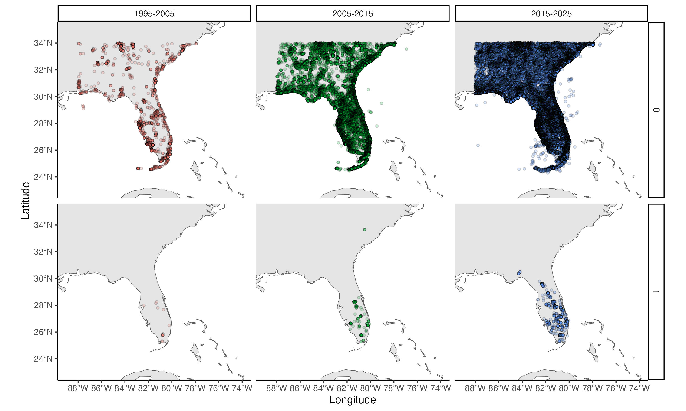

| {width=100%}<br>

# Read me (begin here)

Add description


## Dynamic occupancy model
One of the model for the biotic hypothesis include the colonization probability conditional to the presence of snails ($\gamma | \psi_{Pomacea}$). Let's see the dynamic occupancy model modified from [Royle & Kery (2007)](https://esajournals.onlinelibrary.wiley.com/doi/10.1890/06-0669.1) (Acevedo-Charry et al. In Prep). 

The state submodel, for $t = 1$
$$
z_{m,1} \sim \text{Bernoulli}(\psi_1)
$$

and the subsequent times $t>1$
$$
z_{m,t}|z_{m,t-1} \sim \text{Bernoulli}\left(z_{m,t-1} [1 - \varepsilon_{m,t}] + [1 - z_{m,t-1}] \gamma_{m,t} \right)
$$

The observation submodel
$$
y_{j,m,t} | z_{m,t} \sim \text{Bernoulli}(z_{m,t} \times p_{m,j,t})
$$

We cannot assess detections and no detections for the snails _Pomacea_ spp., thus we are unable to apply a Dynamic co-occurrence model ([Fidino et al. 2019](https://besjournals.onlinelibrary.wiley.com/doi/epdf/10.1111/2041-210X.13117)) or using the estimated occupancy of interacting species ([Lesmeister et al. 2015](https://wildlife.onlinelibrary.wiley.com/doi/10.1002/wmon.1015)). Instead, we can explicitly incorporate the linear relationship of colonization given presence of snails _Pomacea_ spp. in the sampling unit at the same time period: $\text{logit}(\gamma_{m,t}) = \beta_0 + \sum \beta_{s} \times y_{s,m,t}$, where $s$ represents each species in the genus _Pomacea_ in the US ($s = 1,2,...,S = 5$; [Machado-Stredel et al. 2024](https://doi.org/10.1093/ornithology/ukae022)). In other words, the colonization of snail kites to an unocupied site will respond to the detection of any species of snail in that site at the sampling period $t$.

# Packages, models, and functions

## Packages required
```{r package-loading, message=FALSE, warning=FALSE}
#To extract presences of any Pomacea during the sampling period we can use dismo
library(dismo)
#To conduct eBird data filtering and manipulation (see Strimas et al. 2018 and 2023)
  library(auk); 
#To data management and visualization - sevent packages in one
  library(tidyverse)
#To conduct Spatiotemporal Subsampling
  library(dggridR)
#Simple features to encode spatial vector data
  library(sf)
#load maps
  library(maps); 
#composite figure
  library(gridExtra); 
#equation in figure with panels (`ggplot2::ggplot()`; `facet_wrap()`)
  library(ggpubr);
```

# Pomacea species - only detections from GBIF

```{r eval=FALSE}
Ppaludosa = gbif("Pomacea", "paludosa") |>
  filter(year >= 1995, year < 2026,
         month %in% c(4,5), 
         lat > 24, lat < 34, 
         lon > -88, lon < -75)

Pmaculata = gbif("Pomacea", "maculata") |>
  filter(year >= 1995, year < 2026,
         month %in% c(4,5), 
         lat > 24, lat < 34, 
         lon > -88, lon < -75)

Pcanaliculata = gbif("Pomacea", "canaliculata") |>
  filter(year >= 1995, year < 2026,
         month %in% c(4,5), 
         lat > 24, lat < 34, 
         lon > -88, lon < -75)  

Pdiffusa = gbif("Pomacea", "diffusa") |>
  filter(year >= 1995, year < 2026,
         month %in% c(4,5), 
         lat > 24, lat < 34, 
         lon > -88, lon < -75)  

Phaustrum = gbif("Pomacea", "haustrum") |>
  filter(year >= 1995, year < 2026,
         month %in% c(4,5), 
         lat > 24, lat < 34, 
         lon > -88, lon < -75)  
```

But this is painful because the different datasets of Darwin Core in GBIF generate different columns names. We can try to wrap-up all with a function:

```{r eval=FALSE}
get_gbif <- function(genus, species) {
  # the function in dismo
  gbif(genus, species) |>
    # filter in time and space
    filter(
      year >= 1995, year < 2026,
      month %in% c(4, 5),
      lat > 24, lat < 34,
      lon > -88, lon < -75
    ) |>
    # check species name
    mutate(species_name = paste(genus, species)) |>
    # unify columns in a single 'type' (character vs numeric)
    mutate(across(everything(), as.character)) 
}

species_list <- list(
  Ppaludosa     = get_gbif("Pomacea", "paludosa"), #342
  Pmaculata     = get_gbif("Pomacea", "maculata"), #575
  Pcanaliculata = get_gbif("Pomacea", "canaliculata"), #30
  Pdiffusa      = get_gbif("Pomacea", "diffusa"), #6
  Phaustrum     = get_gbif("Pomacea", "haustrum") #no records within the filter
)

snails_gbif <- bind_rows(species_list, .id = "query_name")
```


And we can simplify this dataset to the columns that we need
```{r eval=FALSE}
snails_gbif <- snails_gbif[,c("query_name",
               "lat","lon",
               "year","month", "startDayOfYear", "endDayOfYear","eventDate",
               "key","datasetKey","datasetName","basisOfRecord","references")]
head(snails_gbif, 3)

# return type of the columns saved
snails_gbif$query_name <- as.factor(snails_gbif$query_name)
snails_gbif$lat <- as.numeric(snails_gbif$lat)
snails_gbif$lon <- as.numeric(snails_gbif$lon)
snails_gbif$year <- as.numeric(snails_gbif$year)
snails_gbif$month <- as.numeric(snails_gbif$month)
snails_gbif$startDayOfYear <- as.numeric(snails_gbif$startDayOfYear)
snails_gbif$endDayOfYear <- as.numeric(snails_gbif$endDayOfYear)
saveRDS(snails_gbif, "data/snails_gbif.RDS")
```


We call the data saved in the previous chunk...

```{r}
snails_gbif <- readRDS("data/snails_gbif.RDS")

ggplot(snails_gbif, aes(x = year))+
  facet_wrap(~query_name)+
  geom_bar()+
  theme_classic()
```

..and we can see the map of records of the genus _Pomacea_ in the southestern US

```{r eval=FALSE}
world1 <- sf::st_as_sf(map(database = 'world', plot = FALSE, fill = TRUE))

MapSnails <- ggplot() +
  geom_sf(data = world1) +
  geom_point(data = snails_gbif |> 
               mutate(lustro = ifelse(year >= 1995 & year < 2000, "1995-2000",
                               ifelse(year >= 2000 & year < 2005, "2000-2005",
                               ifelse(year >= 2005 & year < 2010, "2005-2010",
                               ifelse(year >= 2010 & year < 2015, "2010-2015",
                               ifelse(year >= 2015 & year < 2020, "2015-2020",
                               ifelse(year >= 2020 & year <= 2025, "2020-2025",
                                      NA))))))), 
             aes(x = lon,
                 y = lat, 
                 fill = query_name),
             size = 1, shape = 21, alpha = 0.5) +
  facet_wrap(~lustro, ncol = 3)+
  coord_sf(xlim = c(-89, -74), 
           ylim =  c(23, 35)) +
  labs(x = "Longitude", y = "Latitude", fill = "Species")+
  theme_classic() +
  theme(legend.position = "bottom")

ggsave(MapSnails, filename = "data/MapSnails.jpg", 
       width = 225, height = 150, units = "mm")
```


# eBird data organization for Dynamic Occupancy Model

This section is based on [Acevedo-Charry *et al.* (2025)](https://doi.org/10.1111/1365-2664.70108). We should download the `ebd` file from
[eBird](https://ebird.org/data/download). See the supplement to
[Johnston *et al.* (2021)](https://doi.org/10.1111/ddi.13271) in
[Strimas-Mackey *et al.* (2023)](https://ebird.github.io/ebird-best-practices/), which is a key reference for the next section.

## Download eBird data

### Go to eBird and sign in

Go to [eBird](https://ebird.org/data/download). You have to sign-in into
eBird:

| {width=100%}
<br>

### Request data

If you are in the home page, check you are signed-in and move down on the
page to "Request data".

| {width=100%}
<br>

You have to submit an application to have access to the data. Once you
have access, click on "Basic dataset (EBD)" (it will show the window of access).

| {width=100%}
<br>

Then, you can select by species, region, and/or date. In our case, lets
download *Rostrhamus sociabilis* in US.

| {width=100%}
<br>

In the options, include the sampling event data always is a good recommendation. In snail kite for US it will save the sampling event, but for other Neotropical species tested in preliminary attempts, the sampling data was not included and the user should download the "Sampling event data" of 5.5 GB (comprised in `.tar` format). This step is critical for our aim of fitting a dynamic occupancy model and control for imperfect detection!!

| {width=100%}
<br>

After submitting the request, the link to download will arrive to the
email registered in your eBird account. You can save the `.txt` files
in a `data_raw` directory to be called during the refining process through filtering.

| {width=100%}
<br>

These files have the records of the species and (in this case) the sampling file to zero-filling. Unfortunately, eBird does not allow to share this data (anyway the sampling file is ~25 Gb, so GitHub does not allow to put this big dataset there). But I see this as a good practice to ensure replicability. 

## Pre-filtering

We can simplify the eBird data selecting only columns of our interest
(it will reduce the size of the dataset).

```{r columns to filter-ebd, eval=FALSE}
colsE <- c("observer_id", "sampling_event_identifier",
           "group identifier",
           "common_name", "scientific_name",
           "observation_count",
           "country", "state_code", "locality_id", "latitude", "longitude",
           "observation_type", "protocol_name", "all_species_reported",
           "observation_date",
           "time_observations_started",
           "duration_minutes", "effort_distance_km",
           "number_observers")
```

To conduct some filters, we will generate temporal files in our computer. Here we generate only a single temporal file that can be overwritten to assess different species.

```{r temporary filter files, eval=FALSE}
f_ebd <- "data/ebd_Examples.txt" 
f_sed <- "data/sed_Examples.txt" 
```

## Refinament data by filtering

The package `auk`, in combination with `tidyverse`, allows the filtering
of the eBird data (see [Strimas-Mackey *et al.* 2023](https://ebird.github.io/ebird-best-practices/)). Note that the
first function `auk_ebd()` includes the path of the eBird data downloaded and saved in your working directory (up to December 2025), and it is the initial creation of an `auk_ebd` object. Then, different functions serve to filter the data by the metadata of the checklists. We followed the next order below:

 * records within the boundary box (W,S,E,N): -88,24,-75,34 (`auk_bbox()`)
 * only records and sampling during April-May, assuming the breeding season (see Fig 2 in [Fletcher *et al.* 2024](https://doi.org/10.1111/gcb.17478)) as closed-population (`auk_date()` and using the wildcard `date = c("*-04-01", "*-05-30")`),
 * by protocol (`auk_protocol()`; only traveling or stationary), 
 * by distance (`auk_distance()`; $≤5$ km), 
 * by duration (`auk_duration()`; $≤5$ hours, note the units are in minutes: $300$), and 
 * only complete lists (`auk_complete()`). 
 
Then, the filters defined are converted to an AWK script with the function `auk_filter()`, generating a filtered eBird Reference Dataset (ERD) and sampling reference (SED), stored in the temporal files `f_ebd` and `f_sed`, respectively. The duration of this filter was 20 minutes. Then, the function `read_ebd()` read the filtered files. The duration for this process was 9 additional minutes. Finally, we generate a zero-filled file, a process of duration 4 additional minutes, plus some time saving the big-size file `snki_zf`.

```{r ebd-filter, eval=FALSE}
start_time <- Sys.time()
ebd_filt<-auk_ebd("data_raw/ebd_US_snakit_smp_relDec-2025/ebd_US_snakit_smp_relDec-2025.txt", #Adjust in case update dataset
                    file_sampling = "data_raw/ebd_US_snakit_smp_relDec-2025/ebd_US_snakit_smp_relDec-2025_sampling.txt") |> #Adjust in case update dataset
    auk_bbox(bbox = c(-88,24,-75,34)) |> #W, S, E, N
    auk_date(date = c("*-04-01", "*-05-30")) %>% #only April-May, weeks 14-22
    auk_protocol(c("Traveling", "Stationary")) %>%
    auk_distance(distance = c(0,5)) %>%
    auk_duration(duration = c(0,300))%>%
    auk_complete() %>%
    auk_filter(f_ebd, f_sed, overwrite=T)

filt_time <- Sys.time()
filt_duration <- filt_time - start_time
print(filt_duration)  

#and with read_ebd we apply another filter to avoid repeat records from groups and call the two datasets from eBird (ebd and sed)
read_files_time <- Sys.time()
sed_only <- read_sampling(f_sed)
ebd_only <- read_ebd(ebd_filt)
read_files_duration <- Sys.time() - read_files_time
print(read_files_duration)
  
#Zero fill - Infer absences of events given the observations
start_zf_time <- Sys.time()
snki_zf <- auk_zerofill(ebd_only, sed_only, collapse = T)
zf_duration <- Sys.time()-start_zf_time
print(zf_duration)
saveRDS(snki_zf, "data/snki_zf.RDS")
```


With the zero-filled file, we can confirm some sampling metadata and "construct" our "robust design" for Dynamic Occupancy Modeling. Then, just for the sake of double checking and organization, we can remove the observations without counts (dubious `X` counts), add distance $0$ to stationary protocols, modify the time of observations started to decimal, round hour sampling to an integer, extract year, month, week, and day_of_year. Also, we can confirm and filter out by effort, such as observers $≤10$, distance $≤5 \text{ km}$, and duration $≤5 \text{ hours}$. These covariates could be further used to test their effects on population dynamic estimates (see [Fink *et al.* 2023](https://besjournals.onlinelibrary.wiley.com/doi/10.1111/2041-210X.14186)).

```{r eval = FALSE}
snki_zf <- readRDS("data/snki_zf.RDS")
#Effort and more filtering (30 days per year, Julian days 123-152)
  # Function to convert time observation to hours since midnight
time_to_decimal <- function(x) {
    x <- hms(x, quiet = TRUE)
    hour(x) + minute(x) / 60 + second(x) / 3600
  }
  
snki_eff <- snki_zf |>
    mutate(
      # Convert X counts to NA
      observation_count = as.integer(observation_count),
      # effort_distance_km to 0 for non-travelling counts
      effort_distance_km = if_else(protocol_name == "Stationary",
                                   0, effort_distance_km),
      # convert time to decimal hours since midnight
      time_observations_started = time_to_decimal(time_observations_started),
      hour_sampling = round(time_observations_started, 0),
      # split date into year, month, week, and day of year
      year = year(observation_date),
      month = month(observation_date),
      week = week(observation_date),
      day_of_year = yday(observation_date)) |>
    filter(number_observers <= 10,	       #Only list with less than 10 observers
           effort_distance_km <= 5,        #be sure of distance effort
           duration_minutes <= 300)        #be sure of duration effort
 #          day_of_year %in% (123:152),     #only the days of May - we can change this
#           hour_sampling %in% (6:11))      #only sampling in the morning 
saveRDS(snki_eff, "data/snki_eff.RDS")
```

This dataset with effort include the `species_observed == TRUE` for detections and `species_observed == FALSE` for no detections. We can filter out a temporal bias in sampling, which provides information that the species begins to be recorded in low prevalence since 1979. We will filter out data from 1995 (this could be adjusted).

```{r eval=FALSE}
snki_eff <- readRDS("data/snki_eff.RDS")

snki_eff |> 
  filter(species_observed == TRUE) |> 
  group_by(year, state) |> 
  count() |> #View()
  ggplot(aes(x = year, y = log(n), color = state))+
    geom_point()+
    theme_classic()
ggsave(filename = "data/Timeline_snki_US_eff.jpg")
```


## Spatiotemporal subsampling in hexagons

The construction of detection histories from eBird will assume spatiotemporal subsampling, collapsing the sampling in spatial sampling units of $\sim32 \text{ km}^2$ (spacing of ~5.6 km, Characteristic Length Scale - CLS ~6.4). To construct a discrete global grid system, we can use the function `dgconstruct()` in the package `dgconstruct`; the argument `spacing` indicates the spacing between the center of adjacent cells, in our case `spacing = 6` indicates a diameter of $\sim6 \text{ km}$, representing an area of $31.99\text{ km}^2$ ($32\text{ km}^2$).

```{r construct discrete global grid}
dggs_pop <- dgconstruct(spacing = 6) 
```

Now we can add a new variable that identify each `cell` from a grid of
hexagons (spatial sampling units), using the `longitude` and `latitude`
information of our `snki_eff` dataset and the function
`dgGEO_to_SEQNUM()`. With the new variable, we can extract the number of checklists in a cell an a single random observations (with detection or no detection). This process had a duration of 21.5 minutes.

```{r add cellID, eval=FALSE}
#specify seed for random number generation
set.seed(1234)
ss_start <- Sys.time()
SnailKite <- snki_eff |>
  filter(year >= 1995) |> #this remove a lot of no detections
  #id for each cell based on longitude-latitude
  mutate(cell = dgGEO_to_SEQNUM(dggs_pop, 
                                longitude, latitude)$seqnum) |>
  # group to select a random checklist per cell/year/month/week
  group_by(cell, year, month, week) |>
  mutate(detection = as.integer(species_observed),
         n_lists = n()) |>
  # this could be sample with or without detection
  sample_n(size = 1) |> 
  ungroup()
#and save the filter
saveRDS(SnailKite, "data/SnailKiteCellsID_filtered.rds")
ss_duration <- Sys.time()-ss_start
print(ss_duration)
```

<br>

Let's see the saved file
```{r calling SnailKite rds, eval = FALSE}
SnailKite <- readRDS("data/SnailKiteCellsID_filtered.rds")
summary(SnailKite)
```
<br>

We can do a map for detections and no detections
```{r eval = FALSE}
#Load a map of the world
world1 <- sf::st_as_sf(map(database = 'world', plot = FALSE, fill = TRUE))
world1

MapRecords <- ggplot() +
  geom_sf(data = world1) +
  geom_point(data = SnailKite |> 
               mutate(decade = ifelse(year >= 1995 & year < 2005, "1995-2005",
                               ifelse(year >= 2005 & year < 2015, "2005-2015",
                               ifelse(year >= 2015 & year <= 2025, "2015-2025",
                                      NA)))), 
             aes(x = longitude,
                 y = latitude, 
                 fill = factor(decade, 
                               levels = c("1995-2005",
                                          "2005-2015",
                                          "2015-2025"))),
             size = 1, shape = 21, alpha = 0.2) +
  facet_grid(factor(detection)~factor(decade, 
                               levels = c("1995-2005",
                                          "2005-2015",
                                          "2015-2025")))+
  coord_sf(xlim = c(-89, -74), 
           ylim =  c(23, 35)) +
  labs(x = "Longitude", y = "Latitude", fill = "Detection state")+
  theme_classic() +
  theme(legend.position = "none")
ggsave(MapRecords, filename = "data/MapRecords2.jpg", 
       width = 250, height = 150, units = "mm")
```

